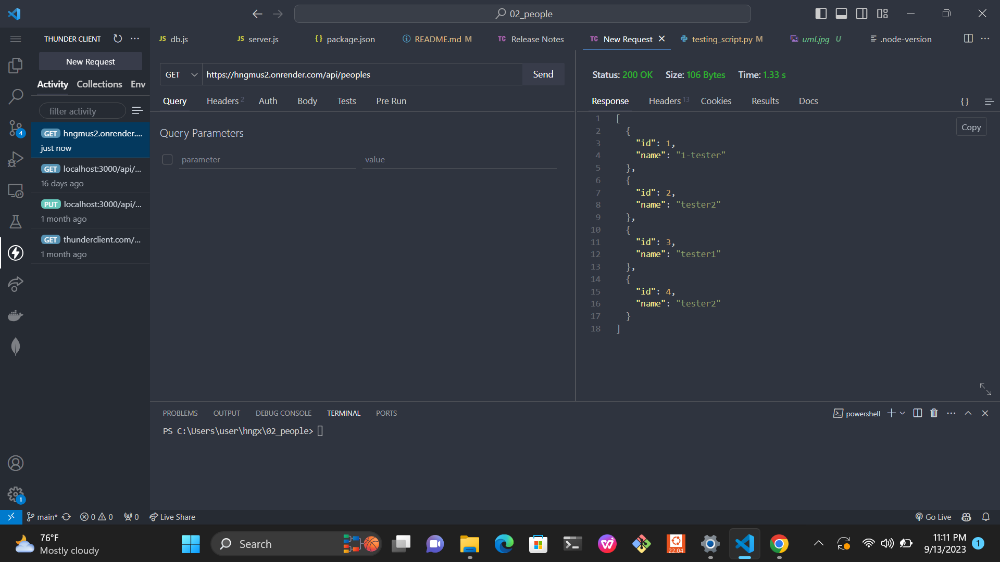

## Running of the code

Requirements: Have mongodb, node of version greater than 17

1. Type `npm install`
2. Link you mongodb with .env files
3. Type `npm start`

## Documentation of the People API

The documentation of ***People API*** written by [Oyebamiji Mustapha](https://twitter.com/musoye1)

### People

The url for testing [https://hngmus2.onrender.com/api](https://hngmus2.onrender.com/api)

Data inside {id, name}

GET /peoples -> get all people

POST /peoples -> create a new people
The json must contain **name** key with a value

PUT /people/:id -> update a person with a particular id

GET /people/:id-> get all info about a particular person with a particular id

DELETE /people/:id -> delete a particular person with a particular id

GET /people_search-> search for a person with a name(the name will come in the form of a query paramter as name is the key)

### Stats

GET /stats -> state the number of people in the api database

## Testing

